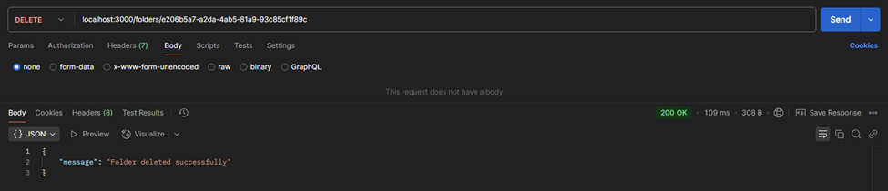

# Document Management System API

## Overview

This is a backend APIs service for a Document Management System built using Node.js, Express.js, Sequelize, and Supabase PostgreSQL. It provides RESTful endpoints for managing folders and files, including CRUD operations, metadata retrieval, and file sorting.

### Postman APIs Testing Screenshots

The API has been tested with Postman, and testing screenshots are included. [Screenshots](#testing-with-postman)

## Features

- **Folder Management**: Create, update, delete, and retrieve folders.
- **File Management**: Upload, update descriptions, delete, and fetch files within folders.
- **File Metadata**: Retrieve metadata of files stored in folders.
- **Sorting & Filtering**: Get files within a folder sorted by specific criteria.

## Tech Stack

- **Node.js** (Backend)
- **Express.js** (API Framework)
- **Sequelize** (ORM for PostgreSQL)
- **Supabase PostgreSQL** (Database)
- **Multer** (Middleware for file uploads)

## API Endpoints

### Folder Routes

| Method | Endpoint             | Description           |
| ------ | -------------------- | --------------------- |
| POST   | `/folders/create`    | Create a new folder   |
| PATCH  | `/folders/:folderId` | Update folder details |
| DELETE | `/folders/:folderId` | Delete a folder       |
| GET    | `/folders/`          | Retrieve all folders  |

### File Routes

| Method | Endpoint                            | Description                               |
| ------ | ----------------------------------- | ----------------------------------------- |
| POST   | `/folders/:folderId/files`          | Upload a file to a folder                 |
| PATCH  | `/folders/:folderId/files/:fileId`  | Update file description                   |
| DELETE | `/folders/:folderId/files/:fileId`  | Delete a file from a folder               |
| GET    | `/folders/:folderId/files`          | Get all files in a folder                 |
| GET    | `/folders/:folderId/filesBySort`    | Get sorted files within a folder          |
| GET    | `/folders/:folderId/files/metadata` | Get file metadata                         |
| GET    | `/files/`                           | Retrieve files across all folders by type |

## File Uploads

- Files are uploaded using **Multer**.
- Uploaded files are stored in the `uploads` directory inside the project repository.
- Ensure the `uploads` folder exists before running the server to avoid errors.

## Installation

### Prerequisites

- **Node.js** v16+
- **PostgreSQL** database (Supabase recommended)

### Steps

1. Clone the repository:
   ```sh
   git clone https://github.com/Deepak-Dalal/Document-Management-System.git
   ```
2. Navigate to the project directory:
   ```sh
   cd Document-Management-System
   ```
3. Install dependencies:
   ```sh
   npm install
   ```
4. Set up environment variables:
   - Create a `.env` file in the root directory.
   - Add the following:
     ```env
     DB_USER=your_db_username
     DB_PASSWORD=your_db_password
     DB_NAME=your_db_name
     DB_HOST=your_db_host
     DB_PORT=your_db_port
     PORT=your_port_number
     ```
5. Run database migrations:
   ```sh
   npx sequelize db:migrate
   ```
6. Run the development server:
   ```sh
   npm start
   ```

The API will be accessible at `http://localhost:<PORT>`.

## Future Enhancements

- User Authentication & Authorization
- Cloud Storage Integration (e.g., AWS S3, Google Drive)
- Pagination & Search Functionality

## Testing with Postman

Folder Functionalities

1.1 Create Folder  
✅ Valid request  


❌ Missing attributes  


❌ Name is not unique  


❌ Invalid type  


❌ Invalid maxFileLimit  


1.2 Update Folder  
✅ Valid request  


❌ Invalid folderId  


❌ Invalid type and maxFileLimit  


1.3 Delete Folder  
✅ Valid request  


❌ Invalid folderId  


File Functionalities

Upload File  
✅ Valid request  


❌ Folder doesn’t exist  


❌ File type mismatch  


❌ Exceeds folder limit  


❌ Exceed file limit of 10MB  


Update File Description  
✅ Valid request  


❌ File doesn’t exist in the specified folder  


Delete File  
✅ Valid request  


❌ File doesn’t exist in the specified folder  


Read Functionalities

Get All Folders  
✅ Valid request  


Get Files in a Folder  
✅ Valid request  


❌ Empty folder  


Sort Files by Size  
✅ Valid request  


Sort Files by Recency  
✅ Valid request  


Get Files by Type Across Folders  
✅ Valid request  


Get File Metadata  
✅ Valid request  

